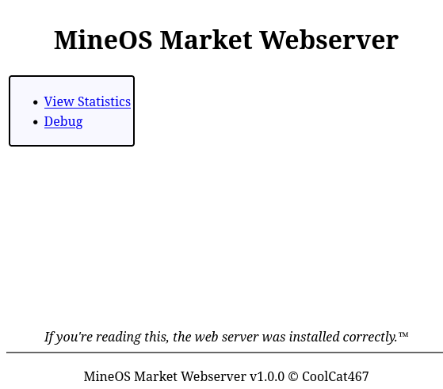
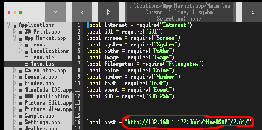

# MineOS-Market-Server
Python MineOS App Market Server Reimplementation

[](https://github.com/CoolCat467/MineOS-Market-Server/actions/workflows/tests.yml)
<!-- BADGIE TIME -->

[](https://results.pre-commit.ci/latest/github/CoolCat467/MineOS-Market-Server/main)
[](https://github.com/pre-commit/pre-commit)
[](https://github.com/psf/black)
[](https://github.com/astral-sh/ruff)

<!-- END BADGIE TIME -->



## Description
Python re-implementation of the server side of the [MineOS](https://github.com/IgorTimofeev/MineOS) App Market

## Installation
Ensure Python 3 is installed on your computer, and use pip to
install this project with the command listed below:

```console
pip install git+https://github.com/CoolCat467/MineOS-Market-Server.git
```

## Usage
Run the server:
```console
mineos_market_server
```
Go to URL `http://<IP_of_host>:3004`
On default, the web server is hosted on port `3004`.
This can be changed in the configuration file (more info below)

If you need to stop the server, use Ctrl+C to shut it down cleanly.

Important Note: If you don't enable SSL support, login credentials are sent to server in clear text!

## Integrating with Official App Market Client
To use the server with the official app market client, you will need to modify
the official app market client's code to point to where you are hosting this
server from, instead of the official servers.

To do this, use the built-in `MineCode IDE` application, go to
Applications > App Market.app > Main.lua, and at the time of writing
at least close by the top of the file you should see a line saying something like

```lua
local host = "http://mineos.buttex.ru/MineOSAPI/2.04/"
```

You will need to change this to the address of the server, for example:

```lua
local host = "http://localhost:3004/MineOSAPI/2.04/"
```



If you enable SSL support, you can make it `https` instead of `http`!

If you are hosting the server locally, you will need to allow opencomputers
to access "private" IP addresses.

Edit your opencomputers configuration file (usually located at `.minecraft/config/opencomputers/settings.conf`),
and close to line 675 or so you need to change `deny private` to `allow private`,
otherwise you will encounter the "Address is not allowed" issue.

## Configuration
Configuration file locations follow the [XDG Base Directory Specification](https://specifications.freedesktop.org/basedir-spec/basedir-spec-latest.html).
Main configuration file lives at `$XDG_CONFIG_HOME/mineos_market_webserver/config.toml`, or `$HOME/.config/mineos_market_webserver/config.toml` if unset.
In the main configuration file you can change things like what port(s)
the webserver is hosted on, hypercorn configuration, and enabling
SSL support!

Database records live in `$XDG_DATA_HOME/mineos_market_webserver/records/`, or `$HOME/.local/share/mineos_market_webserver/records/` if unset.
- `ids.json` is for remembering what the next ID for publications and reviews should be.
- `login.json` is for remembering login token -> username associations that expire after some time.
- `messages.json` is for remembering messages sent between users.
- `publications.json` is for remembering publication data.
- `reviews.json` is for remembering reviews on publications and votes on reviews.
- `users.json` is for remembering user data. Passwords are hashed with sha3_256.

## Enabling SSL Support
If you would like to enable SSL support, it's a bit tricky but it's doable,
successfully tested in production, and completely free!
1) Make sure your internet router is set to have the machine running
the webserver to have a static ip address. This does not need to be
a publicly accessible ip address.
2) Create a free account with [duckdns](https://www.duckdns.org/)
3) Add a domain with a name of your choice and set the ip to the static ip
address of the machine running the webserver.
4) Install certbot on the machine running the webserver.
(https://certbot.eff.org/instructions)
When it asks `software`, tell them `other`.
For my installation, I ended up [installing it with pip](https://pypi.org/project/certbot/).
5) Install the [certbot duckdns plugin](https://github.com/infinityofspace/certbot_dns_duckdns) for certbot
6) Either run certbot from duckdns plugin's README or run [/scripts/cert_create.sh](https://github.com/CoolCat467/MineOS-Market-Server/blob/main/scripts/cert_create.sh) with your details.
7) Setup autorenewal from [certbot wiki](https://eff-certbot.readthedocs.io/en/latest/using.html#setting-up-automated-renewal) or look at [/scripts/cert_renew.sh](https://github.com/CoolCat467/MineOS-Market-Server/blob/main/scripts/cert_renew.sh)
8) Uncomment SSL lines in the webserver configuration file ([see section above](https://github.com/CoolCat467/MineOS-Market-Server#configuration)) and edit as needed for your particular setup.
